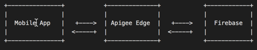
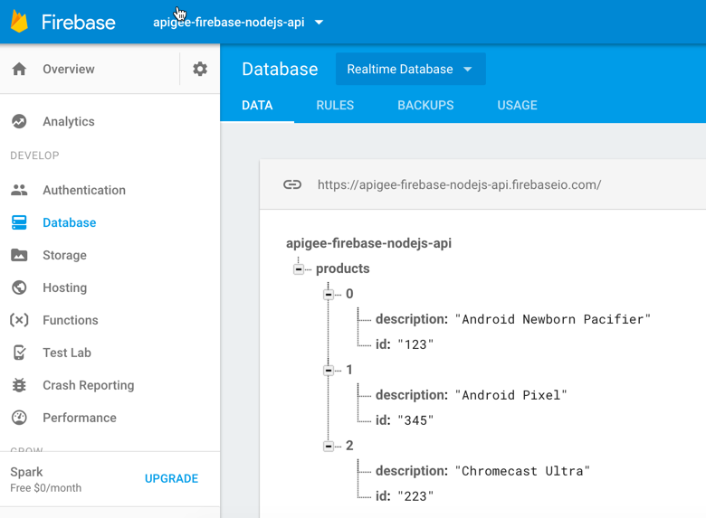

apigee-firebase-nodejs-express-api
==================================
How to setup Apigee in the middle between Apps and Firebase? This API Proxy provides the building blocks to get you started with a Express and Node.js App connected to Firebase leveraging official SDK. This Apps runs locally on your machine as well on Apigee Edge connected to a Database on Firebase.



##Getting Started

### Run and Deploy

#### Run locally
```bash
$ npm install
```

#### Deploy to Apigee Edge

To deploy this API Proxy to Edge, make sure apigeetool is installed in your machine.
```bash
apigeetool deploynodeapp -n apigee-firebase-nodejs-express-ap
i -d . -m index.js -o testmyapi -e test -b /apigee-firebase-nodejs-express-api -u $ae_username -p $
ae_password -V
```

Run
===
```bash
$ apiKey={GET_FROM_FIREBASE_CONSOLE}
 authDomain={GET_FROM_FIREBASE_CONSOLE} databaseURL={GET_FROM_FIREBASE_CONSOLE} projectId={GET_FROM_FIREBASE_CONSOLE} messagingSende
rId={GET_FROM_FIREBASE_CONSOLE} node index.js
```
Test
====

#### Create Records in Firebase

```javascript
app.post('/products', function (req, res) {
  var ref = firebase.database().ref('/products');
  var obj = [{
      id: "123",
      description: "Android Newborn Pacifier"
    },
    {
      id: "345",
      description: "Android Pixel"
    },
    {
      id: "223",
      description: "Chromecast Ultra"
    }
  ];
  res.send(ref.push(obj)); // Creates a new ref with a new "push key"
  ref.set(obj); // Overwrites the path
  ref.update(obj); // Updates only the specified attributes
})
```

Execute this command:
```bash
curl -X POST http://localhost:3000/products

curl -X POST http://testmyapi-test.apigee.net/apigee-firebase-nodejs-express-api/products -d ''

**Empty body, so Edge doesn\'t complain.**

```


#### Read records from Firebase

```bash
$ curl -X GET http://localhost:3000/products

Returns:

[{"description":"Androi`d Newborn Pacifier","id":"123"},{"description":"Android Pixel","id":"345"},{"description":"Chromecast Ultra","id":"223"}]

#### Test in Edge
$ curl -X GET http://testmyapi-test.apigee.net/apigee-firebase-nodejs-express-api/products
```

#### How to configure environment variables in Edge for Node.js
As security best practice you noticed that in order to protect from leaking credentials in your source code, we used process.env variables as below. Therefore, to set these variable, it is recommended to leverage EnvironmentVariables from TargetEndpoint in the next section.

```javascript
var config = {
  apiKey: process.env.apiKey,
  authDomain: process.env.authDomain,
  databaseURL: process.env.databaseURL,
  storageBucket: process.env.storageBucket,
  messagingSenderId: process.env.messagingSenderId
};
```

```xml
<?xml version="1.0" encoding="UTF-8" standalone="yes"?>
<TargetEndpoint name="default">
    <ScriptTarget>
        <EnvironmentVariables>
            <EnvironmentVariable name="apiKey">{REPLACE_ME}</EnvironmentVariable>
            <EnvironmentVariable name="authDomain">{REPLACE_ME}</EnvironmentVariable>
            <EnvironmentVariable name="databaseURL">{REPLACE_ME}</EnvironmentVariable>
            <EnvironmentVariable name="projectId">{REPLACE_ME}</EnvironmentVariable>
            <EnvironmentVariable name="messagingSenderId">{REPLACE_ME}</EnvironmentVariable>
        </EnvironmentVariables>
        <ResourceURL>node://index.js</ResourceURL>
    </ScriptTarget>
</TargetEndpoint>
```