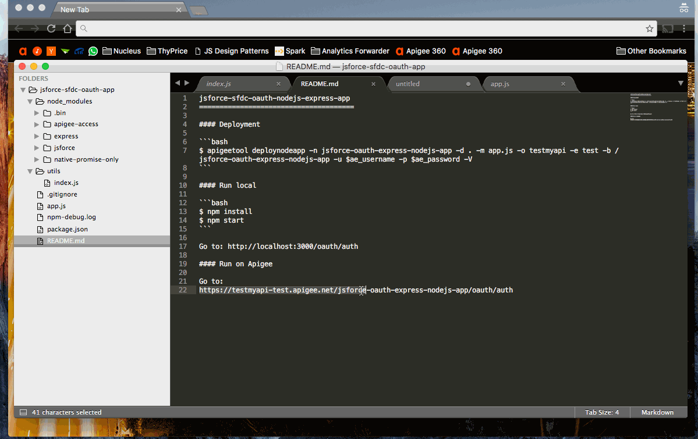

jsforce-sfdc-oauth-nodejs-express-app
======================================
Example of three-legged oauth with SalesForce leveraging jsforce Node.js module, express, and Apigee.



#### Configuration

Replace app.js with SFDC credentials
```javascript
var sforce_credentials = {
    clientId: process.env.clientId || 'REPLACE_WITH_SFDC_CLIENT_ID',
    clientSecret: process.env.clientSecret || 'REPLACE_WITH_SFDC_CLIENT_SECRET',
    redirectUri: process.env.redirectUri ||  'REPLACE_WITH_SFDC_REDIRECT_URI'
}
```

#### Run locally

```bash
$ npm install
$ npm start
```

**use `clientId={clientId} clientSecret={clientSecret} redirectUri={redirectUri} npm start`**

Go to: http://localhost:3000/oauth/auth

#### Run on Apigee

##### Deploy

```bash
$ apigeetool deploynodeapp -n jsforce-oauth-express-nodejs-app -d . -m app.js -o testmyapi -e test -b /jsforce-oauth-express-nodejs-app -u $ae_username -p $ae_password -V
```

Go to:
https://testmyapi-test.apigee.net/jsforce-oauth-express-nodejs-app/oauth/auth

**Uncomment sections to use Apigee Vault to store clientId, clientSecret, and redirectUri.**