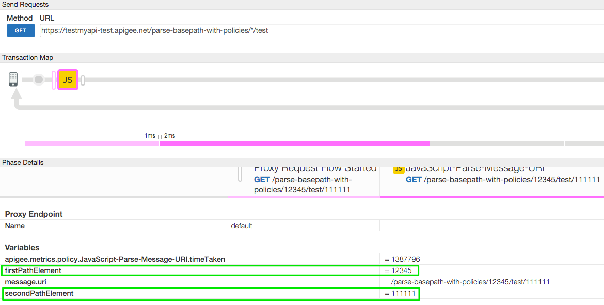

parse-basepath-with-policies
=========
Currently ExtractVariables policy (URIPath element specifically) can only parse the path suffix. Here's an altenative to parse the basepath with JavaScript:



### how to parse with JS policies?

```javascript
var pathArray = context.getVariable("message.uri").split("/");
context.setVariable( "firstPathElement", pathArray[2] );
context.setVariable( "secondPathElement", pathArray[4] );
```

### how to deploy this api proxy?
```bash
apigeetool deployproxy  -u $ae_username -p $ae_password -o testmyapi -e test -n parse-basepath-with-policies -d . -V
```

### how to test it?

```bash
curl https://testmyapi-test.apigee.net/parse-basepath-with-policies/12345/test/111111 -v
```